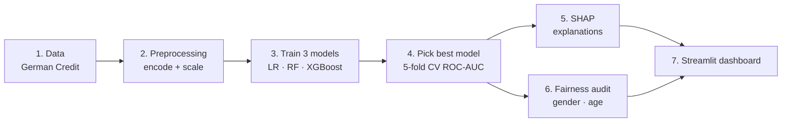

# 🏦 Explainable Loan Risk Predictor

> A machine-learning web app that predicts whether a loan applicant is likely to **default**,
> explains **why** in plain language, and checks whether the model treats different groups **fairly**.

M.Sc. Computer Science (Part II, Sem III) project — Rashtrasant Tukadoji Maharaj Nagpur University, 2026-27.

---

## 📑 Contents
- [What is this project?](#-what-is-this-project)
- [How it works](#-how-it-works)
- [Before you start (requirements)](#-before-you-start-requirements)
- [Part 1 — Quick start: how to run the project](#-part-1--quick-start-how-to-run-the-project)
- [Part 2 — Get the project from GitHub to your computer](#-part-2--get-the-project-from-github-to-your-computer)
- [Part 3 — Step-by-step run guide (for beginners)](#-part-3--step-by-step-run-guide-for-beginners)
- [Using the dashboard](#-using-the-dashboard)
- [Results](#-results)
- [Project structure](#-project-structure)
- [Troubleshooting](#-troubleshooting)
- [Glossary](#-glossary-simple-meanings)
- [References](#-references)

---

## 💡 What is this project?

**The problem.** Banks use machine learning to decide who gets a loan. But most models are
**"black boxes"** — they say *"rejected"* without saying *why*. An applicant cannot understand
the decision, and the bank cannot easily check whether the model is unfair to some groups
(for example, women or young people).

**The solution.** This project builds a loan-risk system that is:

| | Pillar | What it means in this project |
|---|---|---|
| 🎯 | **Accurate** | Three ML models (Logistic Regression, Random Forest, XGBoost) are trained and compared; the best one is chosen automatically. |
| 🔎 | **Explainable** | For every applicant, **SHAP** shows which factors pushed the risk up or down, plus a summary in simple English. |
| ⚖️ | **Auditable** | A **fairness report** checks whether approval rates differ between genders and age groups. |

Everything is shown in an interactive **Streamlit** web dashboard (dark mode by default, with a light-mode button).

**The data.** The public **UCI Statlog (German Credit)** dataset — 1,000 real loan applicants,
20 attributes (account status, loan amount, duration, savings, job, age …), and whether they
repaid or defaulted (30% defaulted). It is already included in this repository.

---

## ⚙️ How it works



1. **Data** — `src/prepare_data.py` turns the coded UCI file into a readable table.
2. **Preprocessing** — missing values filled, categories one-hot encoded, numbers scaled.
3. **Training** — `src/train.py` trains 3 models on 80% of the data and tests them on the other 20%.
4. **Selection** — the model with the best cross-validated ROC-AUC is saved (currently **Random Forest**).
5. **Explanation** — `src/explain.py` uses SHAP to measure each factor's effect on each prediction.
6. **Fairness** — `src/fairness.py` computes Demographic Parity, Equal Opportunity and Disparate Impact.
7. **Dashboard** — `app.py` puts it all together in the browser.

> Gender is **never** given to the model as an input — it is only used to *check* fairness.

---

## ✅ Before you start (requirements)

| You need | How to check | Where to get it |
|---|---|---|
| **Python 3.12 or 3.13** ⚠️ | `python --version` | https://www.python.org/downloads/ — tick **"Add Python to PATH"** during install |
| **Git** (only for Option A below) | `git --version` | https://git-scm.com/downloads |
| ~1 GB free disk space | — | — |

> ⚠️ **Python 3.11 or older will NOT work** — some libraries (numpy, xgboost, shap) need 3.12+.
> If you have several Python versions on Windows, you can pick one with `py -3.12`.

Internet is needed only once, to install the libraries. After that the project runs offline.

---

## 🚀 Part 1 — Quick start: how to run the project

Already have the project folder and Python 3.12+? Open a terminal **inside the project folder** and run:

**Windows (Command Prompt):**
```bat
python -m venv .venv
.venv\Scripts\activate
pip install -r requirements.txt
streamlit run app.py
```

**macOS / Linux:**
```bash
python3 -m venv .venv
source .venv/bin/activate
pip install -r requirements.txt
streamlit run app.py
```

Your browser opens **http://localhost:8501** with the dashboard. 🎉
The trained models are already included, so no training is needed.
Press **Ctrl + C** in the terminal to stop the app.

New to this? Follow the detailed guide in [Part 3](#-part-3--step-by-step-run-guide-for-beginners).

---

## 📥 Part 2 — Get the project from GitHub to your computer

Repository: **https://github.com/Gaurav-Ds/Explainable-Loan-Risk-Predictor**

### Option A — Using Git (recommended)

1. Open a terminal:
   - **Windows:** press `Win`, type **cmd**, press Enter.
   - **macOS:** open **Terminal**. **Linux:** open your terminal app.
2. Go to the folder where you want the project, e.g. your Desktop:
   ```bash
   cd Desktop
   ```
3. Download (clone) the project:
   ```bash
   git clone https://github.com/Gaurav-Ds/Explainable-Loan-Risk-Predictor.git
   ```
4. Enter the project folder:
   ```bash
   cd Explainable-Loan-Risk-Predictor
   ```

To get future updates later, run `git pull` inside this folder.

### Option B — Download as ZIP (no Git needed)

1. Open https://github.com/Gaurav-Ds/Explainable-Loan-Risk-Predictor in your browser.
2. Click the green **`< > Code`** button → **Download ZIP**.
3. Right-click the downloaded ZIP → **Extract All…** and choose a location (e.g. Desktop).
4. Open the extracted folder `Explainable-Loan-Risk-Predictor-main`.
5. Open a terminal in that folder:
   - **Windows:** click the folder's address bar, type `cmd`, press Enter.
   - **macOS:** right-click the folder → **New Terminal at Folder**.

You now have the project on your computer. Continue with Part 3.

---

## 🧭 Part 3 — Step-by-step run guide (for beginners)

All commands are typed in the terminal, **inside the project folder**
(the folder that contains `app.py` and `requirements.txt`).
Windows commands are shown first; macOS/Linux versions are given where they differ.

### Step 1 — Check Python
```bash
python --version
```
You should see `Python 3.12.x` or `Python 3.13.x`.
On macOS/Linux use `python3 --version`. If the version is lower, install Python 3.12+ first.

### Step 2 — Create a virtual environment
A virtual environment is a private box for this project's libraries, so they don't clash with anything else.
```bash
python -m venv .venv
```
macOS/Linux: `python3 -m venv .venv` · Windows with several Pythons: `py -3.12 -m venv .venv`

This creates a `.venv` folder. You only do this **once**.

### Step 3 — Activate the virtual environment
| System | Command |
|---|---|
| Windows – Command Prompt | `.venv\Scripts\activate` |
| Windows – PowerShell | `.venv\Scripts\Activate.ps1` |
| macOS / Linux | `source .venv/bin/activate` |

✅ You'll see **`(.venv)`** at the start of the terminal line. Do this **every time** you open a new terminal.

### Step 4 — Install the libraries
```bash
pip install -r requirements.txt
```
This downloads pandas, scikit-learn, XGBoost, SHAP, Streamlit, Plotly, etc. It takes **3–10 minutes**
the first time. Done **once**.

### Step 5 — (Optional) Rebuild the data and retrain the models
The repository already has trained models, so you can **skip this step**.
Run it if you want to see the full machine-learning pipeline work from the raw data (≈1 minute):
```bash
python src/prepare_data.py
python src/train.py
```
`train.py` prints each model's scores, the selected best model and the fairness results, and saves
the models to `models/` and charts to `reports/figures/`.

### Step 6 — (Optional) Run the automated tests
```bash
python -m pytest tests -q
```
Expected result: **`23 passed`** (takes 1–2 minutes). See [TEST_REPORT.md](TEST_REPORT.md) for details.

### Step 7 — Start the dashboard
```bash
streamlit run app.py
```
The browser opens automatically at **http://localhost:8501**.
If it doesn't, open that address yourself. (If Streamlit asks for an email the first time, just press Enter.)

### Step 8 — Try it out
1. Click the **🔍 Predict & Explain** tab.
2. In **"Load a sample applicant"**, choose e.g. *Applicant #…* — or fill in the form yourself.
3. Click **🔮 Predict risk**.
4. See the risk gauge, the ✅ Approve / ⛔ Reject decision, the plain-language explanation and the SHAP chart
   (switch **Bar chart / Waterfall**), and click **📄 Download explanation report**.
5. Open **⚖️ Fairness Report** and move the **Decision threshold** slider in the sidebar to see how fairness changes.
6. Use the **☀️ Light / 🌙 Dark** button (top-right) to switch theme.

### Step 9 — Stop the app
Go back to the terminal and press **Ctrl + C**.

### Next time you want to run it
You don't need to install again. Just open a terminal in the project folder and run:
```bash
.venv\Scripts\activate        # macOS/Linux: source .venv/bin/activate
streamlit run app.py
```

---

## 🖥️ Using the dashboard

| Tab | What you can do |
|---|---|
| 🏠 **Overview** | Project summary (Accurate · Explainable · Auditable), how the system works, objectives, key findings. |
| 🔍 **Predict & Explain** | Enter applicant details → risk gauge, decision, top factors, plain-language explanation, SHAP **bar or waterfall** chart, and a **downloadable explanation report** (HTML). |
| 📊 **Model Comparison** | Accuracy, precision, recall, F1, ROC-AUC for all 3 models, ROC curves and confusion matrices. |
| 🌐 **Global Explanation** | Which factors matter most overall (SHAP importance and beeswarm plot). |
| ⚖️ **Fairness Report** | Approval rates by gender and age group, fairness metrics and a verdict, plus a chart of **how fairness changes with the threshold**. |
| 📁 **Dataset** | Default rate by any feature, plus the full raw data. |

**Sidebar:** choose the model (★ = best), set the decision threshold, switch theme.
Inputs are limited to realistic values; values outside the training data show a reliability warning.

---

## 📈 Results

Held-out test set: 200 applicants, decision threshold 0.5.

| Model | Accuracy | Precision | Recall | F1 | ROC-AUC | 5-fold CV ROC-AUC |
|---|---|---|---|---|---|---|
| Logistic Regression | 0.760 | 0.570 | 0.817 | 0.671 | 0.814 | 0.768 ± 0.058 |
| **Random Forest** (selected) | 0.750 | 0.562 | 0.750 | 0.643 | 0.811 | **0.795 ± 0.046** |
| XGBoost | 0.750 | 0.566 | 0.717 | 0.632 | 0.796 | 0.788 ± 0.038 |

- The best model is chosen by **cross-validated** ROC-AUC on the training data, so the test set stays unbiased.
- Class imbalance (70% repaid / 30% defaulted) is handled with balanced class weights.
- **Top risk factors (SHAP):** checking account status, loan duration, savings, credit history, other installment plans.

**Fairness audit (Random Forest):**

| Attribute | Demographic parity diff. | Equal opportunity diff. | Disparate impact | Verdict |
|---|---|---|---|---|
| Gender | 0.061 | 0.060 | 0.90 | ✅ No significant disparity |
| Age group | 0.236 | 0.233 | 0.64 | ⚠️ Applicants under 25 are approved less often |

---

## 📂 Project structure

```
Explainable-Loan-Risk-Predictor/
├── app.py                    ← the Streamlit dashboard (start here)
├── requirements.txt          ← list of libraries to install
├── README.md                 ← this guide
├── TEST_REPORT.md            ← QA test report
├── .streamlit/config.toml    ← dashboard theme (dark by default)
├── src/
│   ├── config.py             ← settings, file paths, feature lists
│   ├── prepare_data.py       ← Step 1: decode the raw UCI data
│   ├── modeling.py           ← Step 2-3: preprocessing + the 3 models
│   ├── train.py              ← Step 3-4: train, compare, select, save
│   ├── explain.py            ← Step 5: SHAP explanations + plain-language summary
│   └── fairness.py           ← Step 6: fairness metrics
├── tests/
│   ├── test_pipeline.py      ← tests for data, models, SHAP, fairness
│   └── test_app.py           ← tests that drive the dashboard
├── data/
│   ├── raw/german.data       ← original UCI dataset
│   ├── german_credit.csv     ← readable dataset
│   └── processed/            ← train / test split
├── models/                   ← trained models (.joblib)
└── reports/                  ← metrics, fairness results, charts
```

---

## 🛠️ Troubleshooting

| Problem | Fix |
|---|---|
| `'python' is not recognized` | Python isn't installed or not on PATH. Reinstall and tick **"Add Python to PATH"**, or use `py` instead of `python`. |
| `No matching distribution found for numpy==...` | Your Python is older than 3.12. Install Python 3.12/3.13, delete the `.venv` folder and repeat Steps 2–4. |
| `'streamlit' is not recognized` | The virtual environment is not active (no `(.venv)`). Do Step 3 again, or run `python -m streamlit run app.py`. |
| PowerShell says *running scripts is disabled* | Use Command Prompt instead, or run once: `Set-ExecutionPolicy -Scope CurrentUser RemoteSigned` |
| `'git' is not recognized` | Install Git, or use **Option B (Download ZIP)** in Part 2. |
| App shows "Model not found" | Run Step 5 (`python src/prepare_data.py` then `python src/train.py`). |
| `Port 8501 is already in use` | Another copy is running. Stop it with Ctrl + C, or use `streamlit run app.py --server.port 8502`. |
| Browser didn't open | Open http://localhost:8501 manually. |
| Install is very slow / fails midway | Check your internet connection and run `pip install -r requirements.txt` again. |

---

## 📖 Glossary (simple meanings)

| Term | Meaning |
|---|---|
| **Default** | The borrower fails to repay the loan. |
| **Default probability** | The model's estimate (0–100%) that this applicant will default. |
| **Decision threshold** | If the probability is at or above this value, the applicant is marked HIGH risk. |
| **ROC-AUC** | How well the model separates good and bad applicants (0.5 = guessing, 1.0 = perfect). |
| **Precision / Recall** | Of those flagged risky, how many really defaulted / of those who defaulted, how many were caught. |
| **Cross-validation** | Testing the model 5 times on different parts of the training data for a more reliable score. |
| **SHAP** | A method that shows how much each factor pushed one prediction up or down. |
| **Demographic parity difference** | Gap in approval rates between groups (0 = equal). |
| **Equal opportunity difference** | Gap in approval rates between groups, counting only people who actually repaid. |
| **Disparate impact ratio** | Lowest group approval rate ÷ highest; below 0.80 is a warning sign (four-fifths rule). |

---

## 📚 References
1. Lundberg, S. M., & Lee, S. I. "A Unified Approach to Interpreting Model Predictions", NeurIPS 2017.
2. UCI Machine Learning Repository, "Statlog (German Credit Data)".
3. Barocas, S., Hardt, M., & Narayanan, A. *Fairness and Machine Learning*, fairmlbook.org, 2019.
4. Chen, T., & Guestrin, C. "XGBoost: A Scalable Tree Boosting System", KDD 2016.
5. Streamlit documentation — https://docs.streamlit.io
6. Scikit-learn documentation — https://scikit-learn.org
